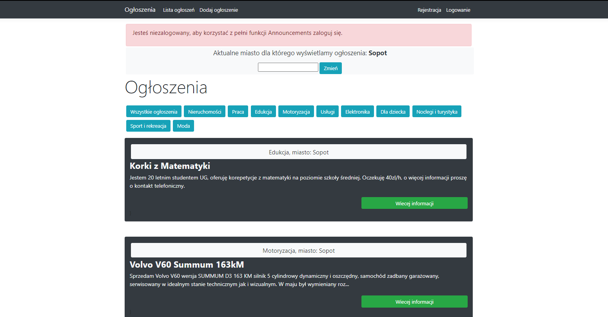
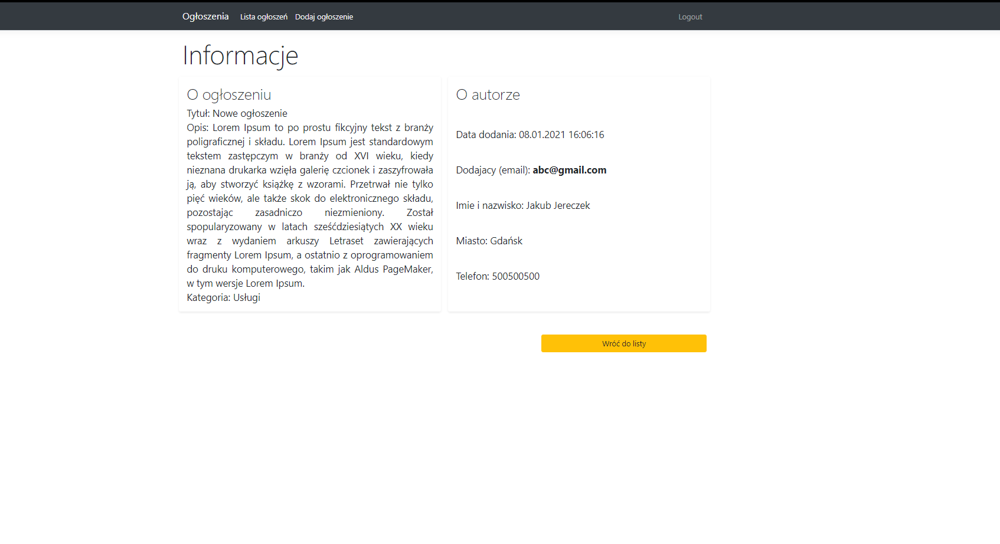
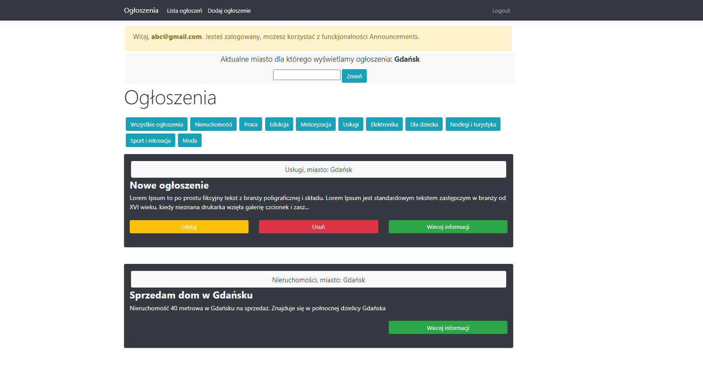

## announcements
My part of working (few days) in group project about technology ASP.NET Core.
In my part of coding I implemented CRUD methods and its views (Create - create new announcements, Read, Update and Delete) methods. 
For each methods we need login account but read is available to everybody. More in the code... 

TODO: Admin panel to accept or don't accept announcements, management (deleting, update etc.).

## Table of contents
* [Technologies](#technologies)
* [Screenshots](#screenshots)

## Technologies
- ASP.NET Core MVC
- Entity Framework,

## Screenshots

